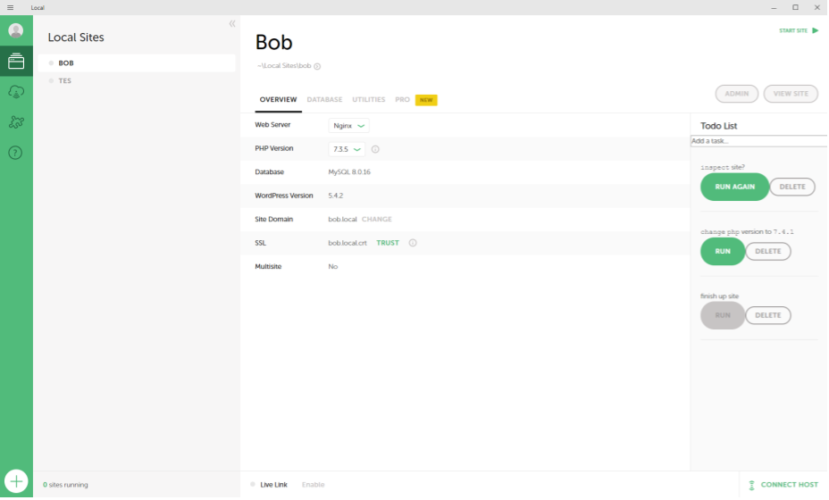
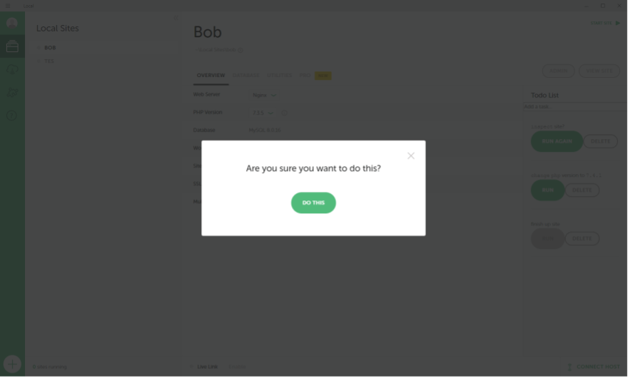

# Local Add-on: Todo

## Description

A todo list that parses a few simple commands.

## Manual Installation

### Clone

Clone the repository into the following directory depending on your platform:

- macOS: `~/Library/Application Support/Local/addons`
- Windows: `%AppData%\Local\addons`
- Linux: `~/.config/Local/addons`

### Install Dependencies
- `yarn install`

### Build
- `yarn build`

## Development

### Folder Structure
All files in `/src` will be transpiled to `/lib` using [TypeScript](http://www.typescriptlang.org/). Anything in `/lib` will be overwritten.

## Usage

Here are the available keywords to activate commands:
- rename: renames the site using the contents of the single quotes (ex. `rename site to 'New Name'`)
- inspect: opens the site in the browser
- change: change a component's (at the moment only PHP) version (ex. `change version of php to 7.4.1`)

Append a question mark at the end of the line to confirm before doing the action.
Example: `change php version to 7.3.5?`

## Screenshots

### A List of Tasks

### Confirmation

## License

MIT
